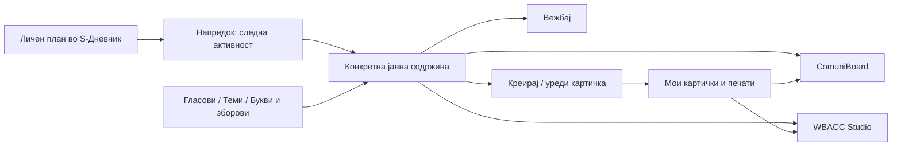

# Од план до вежба — содржини, картички и печати

**10 октомври 2026 · Технички преглед и предлог за изработка.**
Овој документ е план, не опис на веќе изработена надградба. Може да се
предаде на друг развивач/агент за продолжување. Нема ученички имиња,
лични распределби или промени во живата евиденција.

Барањето на сопственикот: истиот „Креирај картичка“ да уредува картички и
печати; полесен избор на теми, букви и зборови; од активност во S-Дневник
директно до соодветната вежба и работа во ComuniBoard или WBACC Studio.
Постојните вежби за гласови остануваат посебни од новите „Букви и зборови“.

## Предложениот систем

**Содржината се избира еднаш, алатката се избира потоа.**
Картичката е зачуваниот материјал; печат е начин таа да се постави во цртеж.
Затоа не правиме три посебни библиотеки со три копии што се уредуваат одделно.

S-Дневник останува сопственик на планот и евиденцијата. Страницата со вежби
добива само идентификатор на содржина: никогаш име, ученички ID, дијагноза,
датум на раѓање или податок за слухот. Не ѝ треба пристап до дневникот.

## Што покажа прегледот на сегашниот код

| Сега | Последица за надградбата |
|---|---|
| `vezbi/index.html`: изборот на трите збирки е во менито за глас; адресата избира само `#vezbi`, `#tabla` или `#crtanje`. | Треба видлив влез за збирките и адреса што памети конкретна содржина. |
| ComuniBoard „Креирај картичка“ праќа PNG преку `insert-generated-image`. | PNG нема одделно изменлив збор, оригинална слика и рамка. Новите картички треба да чуваат и изворен запис. |
| WBACC `Stamps.jsx` ги чита истите 149 готови поими; изменетиот натпис е привремен. | Потребна е трајна лична библиотека и отворање во истиот уредувач. |
| `S-Dnevnik.html`: планот има `activities: string[]`; уредувачот е повеќередно текстуално поле. | Се додава избирач за материјал покрај текстот, без претворање на старите низи во друг формат. |
| `loadStudentProgress` ги прикажува активностите според реден број; присуството ја пополнува следната. | Прередување на започнат план може да ја смени смислата на претходен запис. Реализираните позиции мора да останат зачувани. |
| `import-core.ts` запишува само име и текст на активност; `export-json.ts` ги изнесува истите полиња. | Линк додаден само во браузерот не е доволен: и проекцијата и извозот мора да го зачуваат. |
| `server/src/lib/progress.ts` изведува напредок од присуство. | Отворање вежба, слушање и точен одговор не смеат да запишат одржан третман. |

Прегледот е на кодот при `6ef06ff`, без отворање или промена на вистински
ученички записи. Не е направена проверка на индивидуалните доделени планови.

## Навигација што го чува контекстот

Горниот ред останува за алатките: **Вежби · ComuniBoard · WBACC Studio**.
Во Вежби, веднаш под него, се гледа **Гласови · Теми · Букви и зборови ·
Мои картички**. Изборот на збирка не се крие во менито за буква.

- **Гласови:** глас → слогови / зборови / реченици → степен на помош.
- **Теми:** тема → поим или група поими → именување / работа со зборот.
- **Букви и зборови:** буква → Од Word / На почеток / Во средина / На крај.
- **Мои картички:** лични категории, пребарување и омилени. Не ја заменува
  ниту една од трите готови збирки.

За избран поим се нудат **Вежбај**, **Во ComuniBoard**, **Во WBACC** и
**Уреди картичка**. За цела категорија: **Избери картички**, па истите алатки.
Преносот прво покажува што ќе се додаде; постоен цртеж не се заменува.
Во алатката се гледа кратка патека, на пример „Теми › Овошје“, со
**← Назад кон содржините**. Избраниот поим, филтерот и недовршениот цртеж се
задржуваат при преминување. Back/Forward го следат истиот тек.

На телефон се користат два кратки реда и избор на категорија, без хоризонтална
низа од 31 буква што мора да се пребарува со лизгање. Детскиот режим ги
остава големата слика, зборот, слушањето и јасното следно/назад; уредувањето
е под постојниот „✏️ Уреди“. Звук не почнува сам, а анимацијата е на место.

## Еден уредувач, една лична библиотека

Постојниот **„Креирај картичка“** добива два влеза: празна нова картичка и
веќе избрана картичка/печат. Не се прави уште еден редактор во WBACC.

Уредливи полиња: збор, слика/ARASAAC пиктограм, рамка и бои, збор над/под
сликата или без натпис, лична категорија и аудиоснимка. Прегледот е веднаш
видлив. **Зачувај во библиотека**, **Зачувај како копија**, **Во табла**,
**Во WBACC** и **Преземи PNG** имаат различно и јасно значење.

Готов ARASAAC поим при уредување создава лична варијанта со врска до изворот.
Оригиналниот каталог останува достапен. Лична картичка се ажурира само со
изречно зачувување. Претходно поставените копии на табла не се менуваат
ретроактивно; „Замени ја избраната картичка“ е посебна Undo-операција.

За стар PNG може да се замени сликата, да се исече или да се додаде нов
натпис, но не ветуваме враќање на текстот што веќе е вграден во пикселите.
Сложена WBACC група може да се зачува како печат со зачувани елементи;
нејзината геометрија се уредува во WBACC, а не во едноставниот уредувач.

Личниот запис содржи стабилен ID и ревизија, одделни визуелни полиња,
вградена слика, категорија, извор/лиценца и опционално вградено аудио со
текстот што навистина го изговара. Променет збор не го менува автоматски
постојниот аудиозапис: се прикажува „Снимката го изговара стариот збор“ и
може да се замени. Македонски изговор не се заменува тивко со соседен јазик.
Почетната брзина останува 0,75×; слушни/стоп/тишина се исти во сите алатки.

Складирање: еден заеднички IndexedDB каталог на истата веб-адреса, со
поединечни записи и проверка на ревизија при зачувување од две отворени
страници. Цртежите остануваат во нивните сегашни складишта. Модулот се
вградува при build и во самостојниот WBACC; не се потпираме на еднакво
`file://` складирање во различни прелистувачи. За друг компјутер, адреса или
самостојна датотека се користи **Извези/Увези библиотека** со медиумите.

Пакетот се проверува пред запишување; судир на ID нуди копија или изречна
замена. Оштетен/празен пакет не брише ништо. Неуспешно зачувување е видливо.
Готовите и личните печати се во истиот панел; постојната Excalidraw Library
добива адаптер за внес во него, со зачувани слики, пред да се тргне дуплиот
влез. Каталогот не оди во училишната база. Заслугите на ARASAAC се зачувуваат.

## Планови и почетни предлози

Предлагаме два уредливи шаблона **„Поими и комуникација“** и **„Вежби за
изговор“**, плус слободна можност да се мешаат нивните активности во личен
план. Ова е организација на материјалот според барањето на терапевтот,
не автоматска проценка или дијагноза.

Редослед на приоритет при предлагање:

1. Постоечки личен избор/веќе доделен план останува.
2. Изречно избрана индивидуална насока има предност над општото правило.
3. За подготвителна: предлог **Поими**.
4. За останатите во прегледаната лична листа: предлог **Изговор**, според
   барањето на сопственикот, без впишување каков било податок за слухот.

Сопственикот посочи четири индивидуални исклучоци за „Поими“. Тие се избираат
во приватниот преглед по потврден ученички ID. Не се кодира правило по име,
презиме или одделение; нејасно совпаѓање останува нерешено.

Почетната фреквенција е **2 третмани неделно**, уредлива по ученик. Таа е
цел на планот, не наредба за автоматско додавање/менување термини во
Кабинети. При преглед се покажува ако вистинскиот распоред е различен.

**Неразјаснето:** „76 по 2 третмани неделно“ може да значи 76 третмани
годишно по ученик или 76 ученици. Поставено е прашање до сопственикот.
Не се задаваат 76 годишни активности или масовна распределба додека ова
не се разјасни. Ако се мисли на годишен фонд 76, се чува како уредлива цел;
38 × 2 е пресметка на фондот, не тврдење дека календарот има 38 работни недели.
Празници, отсуства и вистински термини остануваат од постојниот календар.

Примери за организација на материјалот, за терапевтски избор:

| Насока | Пример за пар активности | Материјал |
|---|---|---|
| Поими | Именување избрани овошја → препознавање и составување картички со истите поими | Теми › Овошје → ComuniBoard |
| Изговор | Избран глас во постојните слогови → зборови со тој глас | Гласови › избраниот глас |
| Дополнување | Зборови со избрана буква во средина → групирање со печати | Букви и зборови › Во средина → WBACC |

Не се пропишува ист клинички редослед на сите деца, ниту автоматски премин
на нов глас по две средби. Една содржина може да се повторува во повеќе
планирани третмани. Терапевтот избира гласови, теми и степен на помош.

## Од „Напредок“ до работа

Кога нема план, наместо само празната порака се нуди **Подготви план**:
предложена насока, фреквенција, фонд, преглед на активностите и **Додели**.
За повеќе ученици има приватна табела со предлог и индивидуална измена;
сите постојни планови се означени и по правило се прескокнуваат.
Едно празно поле не значи дозвола да се замени историја.

Кога има план, на врвот стои **Следна планирана активност** со наслов,
материјал и големо **Отвори вежба**. Под неа се претходните и наредните
ставки; секоја има **Вежба**, **ComuniBoard**, **WBACC**, кога има поврзан
материјал. Се отвора посебен работен прозорец/јазиче, па дневникот и избраниот
ученик остануваат на место. Враќање не бара да се избира ученик повторно.

Одржаните средби и натаму се изведуваат од присуството. **76 одржани средби
не значи 76 совладани вештини.** Проценката останува посебна. „Повтори ја
вежбата“ отвора материјал без да одземе или додаде третман; „Смени материјал“
уредува идна ставка без да ја препише минатата. Линк може да има и стар план
без повторно доделување или ресетирање на напредокот.

## Договор за податоците и линковите

Постојното `activities: string[]` останува. Се додава опционална мапа
`activityResources`, по позиција на активност, со проверени референци кон
содржина: збирка, ID на глас/тема/буква, ID на поим или избран сет, позиција
на гласот, степен на помош и преферирана алатка. Нема HTML во текстот на
активноста и нема автоматско погодување линк од зборови во насловот.

Референцата е структурирана; URL се гради од тековната инсталација. Пример
за предложен формат: `vezbi/index.html#vezbi?library=letters&deck=letters-01&position=start`.
Тоа е **идна адреса**, не постоечки функционален линк. Старите `#vezbi`,
`#tabla`, `#crtanje` остануваат валидни. Само дозволени категории/алатки и
познати ID се прифаќаат; непознат материјал покажува избор, без погрешна замена.
Личен печат што недостига на друг компјутер бара увоз на библиотеката.

Веќе реализираните позиции во план не се прередуваат/бришат. Новиот уредувач
дозволува промена на идните ставки и додавање на крај; промена на заеднички
шаблон не ги менува доделените лични копии. За стар заеднички план, границата
се проверува за сите што го користат. Премин на сосема нов план во средина
на година е одделен случај: сегашната пресметка ги реди сите средби врз
тековниот план. Пред таков премин мора да се воведе и тестира датум/основа
на доделување и зачувана стара верзија, усогласено и во браузерот и серверот.
Не го решаваме со ресетирање на присуство или со тивко ресетирање на напредок.

Референците мора да преживеат **IndexedDB → save/sync → PostgreSQL проекција
→ JSON export → повторен import**, не само blob save. Потребно е адитивно
поле за ресурсите кај активностите во релационата база и соодветна миграција.
Стар документ без полето ги задржува постојните линкови; изречно празна листа
отстранува линк. Архивите и content fingerprints се проверуваат за лажни
конфликти; нема пополнување optional defaults што го менува секој стар хеш.
Сè пишува низ постојниот сопственик на плановите, без втор shortcut endpoint.

## Редослед за изработка и проверка

1. **Каталог и навигација.** Стабилни јавни ID, видливи збирки, длабоки линкови,
   зачуван избор и Back/Forward. Проверка: директен линк отворен од нов таб,
   стар линк, непознат ID, телефон, ниска резолуција и офлајн пакет.
2. **Лична библиотека и уредувач.** Креирај → зачувај → повторно отвори →
   измени → постави во двете алатки. Проверка: независни копии, Undo/Redo,
   рестарт, неуспешен запис, истовремено уредување, извоз/увоз со слики и аудио.
   Сложени групи и стар PNG добиваат јасно различно однесување.
3. **Линкови во постојни планови.** Избирач на материјал во уредувачот и копчиња
   во „Напредок“. Миграција + import/export се проверуваат во scratch база
   со измислени ученици. Отворање/повторување не менува ниеден attendance row.
4. **Шаблони и преглед на доделување.** Поими/Изговор, лични измени, 2 неделно,
   потврдено значење на 76. Изборот по ученик и исклучоците се прегледуваат во
   приватната инсталација, без имиња во Git, логови, URL или јавни снимки.
   Се тестираат постоечки план, веќе евидентирани средби без план, сменет план
   среде година, нова учебна година и стар JSON без новите полиња.
5. **Испорака.** Постојните suites за Вежби/аудио/букви/ComuniBoard/WBACC,
   дневнички напредок и JSON round-trip; build на самостојниот WBACC,
   обновен офлајн ZIP и проверки на статичката allowlist. Deploy и миграции
   се конкретна следна испорака, а не дел од овој документ.

Првата целосна вертикална проверка треба да биде: измислен ученик со план
„Поими“ → активност „Овошје“ → избрана картичка → уредување → личен печат →
двете табли → враќање во „Напредок“ со непроменето присуство. Потоа истото
се повторува со глас и позиција на буква. Дури потоа се применуваат предлози
на вистинските лични планови.

Поврзана основа: [VEZBI.md](VEZBI.md),
[PLAN-wbacc-pecati.md](PLAN-wbacc-pecati.md),
[APP-CONTRACT.md](APP-CONTRACT.md), [HISTORY.md](HISTORY.md).
